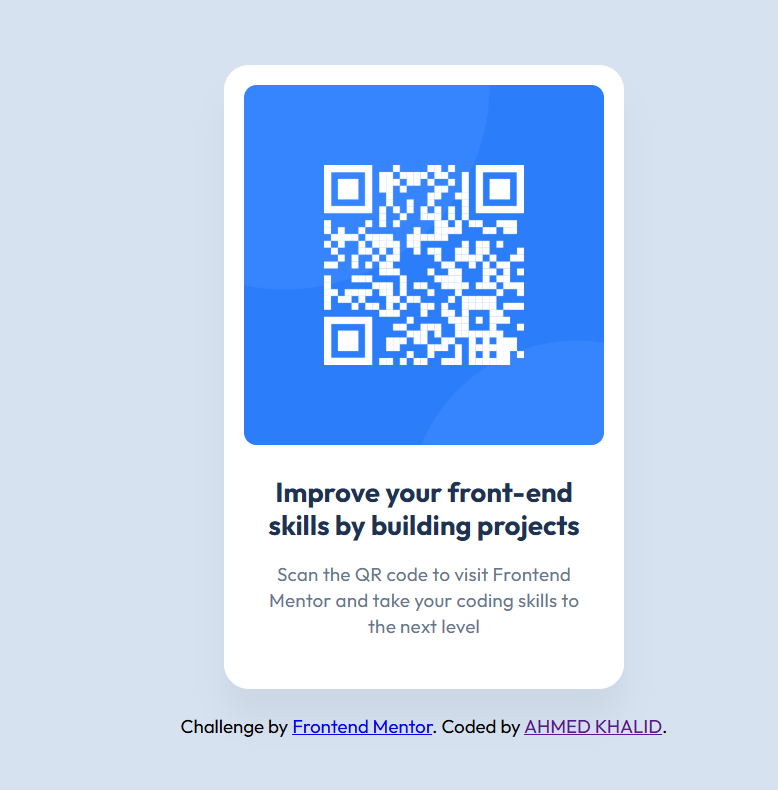

# Frontend Mentor - QR code component solution

This is a solution to the [QR code component challenge on Frontend Mentor](https://www.frontendmentor.io/challenges/qr-code-component-iux_sIO_H). by me ahmed khalid

## Table of contents

- [Overview](#overview)
  - [Screenshot](#screenshot)
  - [Links](#links)
- [My process](#my-process)
  - [Built with](#built-with)
  - [What I learned](#what-i-learned)


## Overview
 Hello, this is my first README file.
 in this project i've learned some usefull things like usibg relative uints and how to build a beter layout using flexbox  

### Screenshot


### Links

- Solution URL: [Add solution URL here](https://your-solution-url.com)
- Live Site URL: [Add live site URL here](https://your-live-site-url.com)

## My process

  In this project i started by adding a container for the card then adding the qr code and the texts (in seperate container) then in the styling the spacing is from the fig file and i used relative units for more flexability 
  and the colors from the styling guide 

### Built with

- Semantic HTML5 markup
- Flexbox
- RELATIVE UNITS


### What I learned
THE MOST IMPORTANT lessons here for me is more about clean code and using relative units and variable colors


```css
:root {
    --White: hsl(0, 0%, 100%);
    --Slate300: hsl(212, 45%, 89%);
    --Slate500: hsl(216, 15%, 48%);
    --Slate900: hsl(218, 44%, 22%);
}


```


